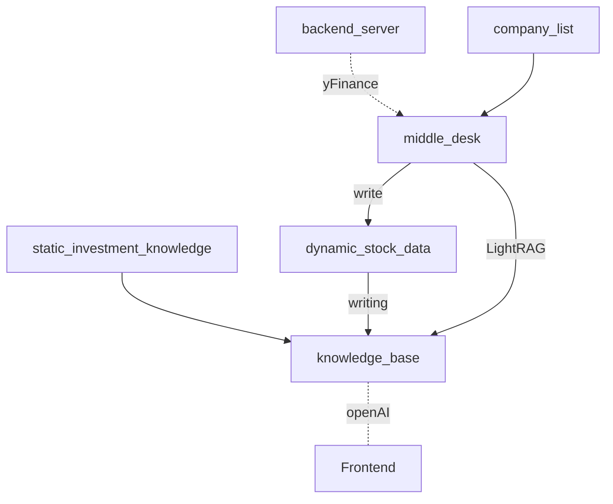

This is an AI-powered investment assistant that integrates `ChatGPT 4o mini`, `LightRAG`, and `yFinance`. It's capable of retrieving real-time financial market data and generating investment recommendations based on current market conditions

## Start the Program
### Config Virtual Env
`conda create -n <name> python=3.10`

### Light RAG
Dependency Install
1. Install from source (Recommend):`pip install -e .` (recommend)
2. Install from PyPI: `pip install lightrag-hku`
3. Install server dependency: `pip install -r requirements.txt`
#### Ollama Model Config
- Ollama install: `curl -fsSL https://ollama.com/install.sh | sh`
- Model Download: `ollama pull qwen2`
- Change the congif for model window context (longer for RAG): 
    ```
    ollama run qwen2
    >>> /set parameter num_ctx 32000
    Set parameter 'num_ctx' to '32000'
    >>> /bye
    ```
- Save the model file: `ollama show --modelfile qwen2 > Modelfile`
- Create a new Model instance based on Model File: `ollama create -f Modelfile qwen2m`
- Start the model for servering: `ollama run qwen2m`
- Check for GPU usage (if applicable): `nvidia-smi`

#### Openai API Config
`export OPENAI_API_KEY="sk-..."`

### Start the Program
- Frontend: `python server.py`
- Middle Desk: `python ./LightRAG/main.py`
- Backend
    - `cd backend`
    - `uvicorn backend:app --reload`

## Structure of the program



## Data Processing
- Company stock information data structure may refer to `./LightRAG/fina/data_format.json`
- Dynamic konwlegde and static knowledge are in `./LightRAG/fina` folder as well.
- When new data appears, the knowledge will be re-written with latest data.
- The program will automatically update the data every 60 seconds (you can adjust this by changing the select timeout)

To simplified the question, the AI bot evaluate and provide suggestions based on 4 matrics, whcih are:
1. basic_info: `[stock_ticker, industry, longBusinessSummary]`
2. risk_metrics: `[beta, debtToEquity, priceToSalesTrailing12Months, shortRatio]`
3. financial_metrics: `[profitMargins, totalCash, totalRevenue, floatShares]`
4. valuation_metrics: `[trailingPE, forwardPE, priceToBook, priceToSalesTrailing12Months]`

## Reference
```
@article{guo2024lightrag,
title={LightRAG: Simple and Fast Retrieval-Augmented Generation},
author={Zirui Guo and Lianghao Xia and Yanhua Yu and Tu Ao and Chao Huang},
year={2024},
eprint={2410.05779},
archivePrefix={arXiv},
primaryClass={cs.IR}
}
```