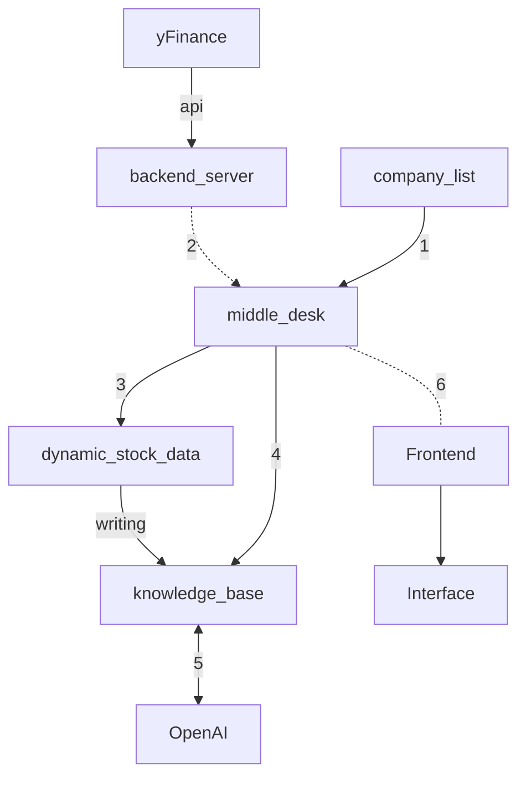

## Structure of the program


```
1. The middleware obtains company stock codes through the company list
2. The middleware queries information from the backend based on the company list
3. The middleware stores the latest stock information in the database and parses the data into the knowledge base

4, 5. The middleware makes requests to OpenAI through Light RAG
6. The middleware sends the obtained responses to the frontend
```
## ENV Config
### Config Virtual Env
`conda create -n <name> python=3.10`

### Light RAG
Dependency Install
1. Install from source (Recommend):`pip install -e .` (recommend)
2. Install from PyPI: `pip install lightrag-hku`
#### Ollama Model Config
- Ollama install: `curl -fsSL https://ollama.com/install.sh | sh`
- Model Download: `ollama pull qwen2`
- Change the congif for model window context (longer for RAG): 
    ```
    ollama run qwen2
    >>> /set parameter num_ctx 32000
    Set parameter 'num_ctx' to '32000'
    >>> /bye
    ```
- Save the model file: `ollama show --modelfile qwen2 > Modelfile`
- Create a new Model instance based on Model File: `ollama create -f Modelfile qwen2m`
- Start the model for servering: `ollama run qwen2m`
- Check for GPU usage (if applicable): `nvidia-smi`

#### Openai API Config
`exportOPENAI_API_KEY="sk-..."` 


### 
## Data Processing
### Data Collection
- Start: `uvicorn parse_data:app --reload` 
- Acquire data from `yfinance`

### Data Storage
- start:`python data_acquire.py`

`./LightRAG/data_acquire.py` is used to regualarly check the data from the backend server and store the stock data into `LightRAG/fina/data.jsonl`. The company list can be modified in `LightRAG/fina/company.json`.

Company stock information data structure
```
[
  {
    "symbol": "AAPL",
    "company_name": "Apple Inc.",
    "industry": "科技公司",
    "exchange": "NASDAQ",
    "currency": "USD",
    "country": "United States",
    "sector": "Technology",
    "variable_data": [
      {
        "price": 170.25,
        "timestamp": "2024-11-21T10:30:00",
        "volume": 1234567,
        "change": 2.5,
        "change_percent": 1.5,
        "market_cap": 2800000000000,
        "pe_ratio": 28.5,
        "high_52week": 180.5,
        "low_52week": 140.2
      },
      {
        // 下一个时间点的数据...
      }
    ]
  },
  {
    // 下一家公司的数据...
  }
]
```

- Log files are created on a daily basis in the format `data_acquire_YYYYMMDD.log`
- A maximum of five up-to-date records are kept for each company's data
The program will automatically update the data every 60 seconds (you can adjust this by changing the select timeout)